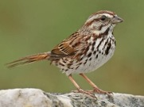
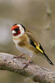
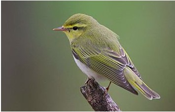
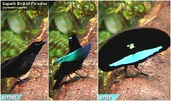
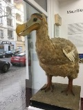
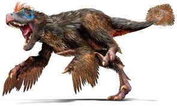

## Some difficult questions

1. What are the most robust crosslinguistic generalizations regarding the interaction between lexicon and grammar?
2. What formal tools can account for these?
3. Is it possible to reach a constrained inventory of lexical primitives (elements/morphemes)?
4. How can these claims be tested experimentally and modeled computationally?

---

## What's a bird?

::: columns
:::: column
{width=3cm}

{width=2cm}
::::

:::: column
{width=3cm}

{width=3cm}
::::
:::

\note{birds birds birds}

---

## What's a bird?

::: columns
:::: column
{width=3cm}

{width=3cm}
::::

:::: column

::::
:::

---

## What's a bird?

::: columns
:::: column
{width=3cm}

{width=3cm}
::::

:::: column
{width=3cm}

::::
:::
---

## What's a bird?

::: columns
:::: column
{width=3cm}

{width=3cm}
::::

:::: column
{width=3cm}

{width=5cm}
::::
:::

---

## What's a bird?

::: columns
:::: column
{width=3cm}

{width=2.5cm}
::::

:::: column

::::
:::

---

## What's a bird?

::: columns
:::: column
{width=3cm}

{width=2.5cm}
::::

:::: column
{width=2.2cm}

{width=2.2cm}
::::
:::

---

## What's a bird?

::: columns
:::: column
{width=4cm}
::::

:::: column

::::
:::

---

## What's a bird?

::: columns
:::: column
{width=4cm}
::::

:::: column
{width=4cm}

::::
:::

---

## What's a bird?

::: columns
:::: column
{width=4cm}
::::

:::: column
{width=4cm}

{width=4cm}
::::
:::

---

## What's a bird?

{width=3cm}

---

## What's a bird?

::: columns
:::: column
{width=3cm}
::::

:::: column
{width=3cm}
::::
:::

---

## What's a *go*?

Are these a "going", a "moving somewhere", a \emph{go}, a \root{\gsc{go}}?

\bigskip

::: columns
:::: column
\Large
*go*
::::

:::: column
\Large
*went*
::::

:::

---

## General starting point

Where (in the grammar) does meaning matter?

What's the relevant *level of granularity*?

1.
	+ In what contexts can you use *dog* and in what contexts can you use *cat*?
	+ In what contexts can you use *blue* and in what contexts can you use *red*?
2.
	+ In what contexts can you use *go* and in what contexts can you use *went*?
	+ In what contexts can you use *assassinate* and in what contexts *give*?

---

## General starting point 

- Our intuition tells us that *dog* and *cat* are different things.
	+ Different nouns/roots/lexemes/etc.
	+ We'll go with the **root** \root{dog} or \root{cat}.
- Our intuition also tells us that *go* and *went* are the same thing.
	+ Both are derived from the root \root{go}.
- Make that intuition explicit:
	+ How do we know that *dog* and *cat* have different **lexical** content?
	+ What does the relevant data look like?

---

## General starting point

- How do we know that *go* and *went* are part of the same verb/root?
- How do we know that *dog* and *cat* are different nouns/roots?
- More precisely:
	+ If you use *go* when you talk about moving events, except if they're in the past, in which case you happen to pronounce the word *went* (**allomorphy**),
	+ Then maybe you use *dog* when you talk about pets, except if it's feline, in which case you happen to pronounce the word *cat* ("allosemy"?).

---

## General starting point

- How do we know that *go* and *went* are part of the same verb/lemma/lexeme/root?
- How do we know that *dog* and *cat* are different nouns/lemmas/lexemes/roots?
- More precisely:
	+ If you use *go* when you talk about moving events, except if they're in the past, in which case you happen to pronounce the word *went*,
	+ Then maybe you use *dog* when you talk about pets, except if it's feline, in which case you happen to pronounce the word *cat*.

. . .

### Some tests [@harley14thlia]

- Ellipsis: *I have three dogs and you have two \_\_\_*.
- Idioms: *The dog is out of the bag*, *It's raining cats and cats*.
- Paradigms: *go*/*went*, *bad/worse/worst* and so on fill in "cells" of a table.

---

## General starting point

1. Different kinds of meaning in grammar:
	+ Morphosyntactic ("grammatical") meanings: tense, number, etc.
	+ Lexical ("conceptual") meanings: kinds of birds, kinds of animals, etc.
2. These different meanings matter for different things ("granularity").
3. So there's a grammatical upshot:
	+ We need to have theories of ellipsis, idioms, morphology, etc.
	+ We need to have theories of what nouns are, etc.
	+ We need to have theories of functions and arguments (e.g. verbs).
4. It isn't trivial to figure out which meanings types are out there and what they influence in the grammar.

- This is the task of lexical semanticists.
- Psychologists and philosophers also worry about some related topics, like whether we decide what a bird is by comparing to a prototype or assembling features [@rosch78].

What phenomena in lexical semantics are we already familiar with?

---

## What's lexical semantics?

::: columns

:::: column

::::

:::: column

::::

:::

---

## What's lexical semantics?

- Mass/count
- Telic/atelic
- Concrete/abstract
- ...

We'll focus on the connection to *argument structure*.

---

## Core transitives

Let's start with some *core/non-core transitives*.

\pex 	\a Kirby grew tomatoes.
	\a The tomatoes grew / Kirby caused the tomatoes to grow.
	\a \ljudge{*} Kirby's growth of tomatoes.
\xe

\pex \a Kirby destroyed the lego tower.
	\a \ljudge{*} The lego tower destroyed / Kirby caused the tower to destroy.
	\a Kirby's destruction of the lego tower.
\xe

- What's going on? Why? How do we encode it? What might it affect? (e.g. agreement, adverbs, argument/event structure, phonology)
- More examples? In more languages?

---

## Some difficult questions

1. What are the most robust crosslinguistic generalizations regarding the interaction between lexicon and grammar?
2. What formal tools can account for these?
3. Is it possible to reach a constrained inventory of lexical primitives (elements/morphemes)?
4. (How can these claims be tested experimentally and modeled computationally?)

### Levels of granularity

When would it matter whether we're talking about:

::: columns

:::: column

- Golden retrievers or pugs
- Dogs or cats
- Pets or farm animals
- Animals or people

::::

:::: column

- Animate or inanimate beings
- Something that can be the object of *assassinate* or not
- Something that can be the object of a verb or not
- Something that's a noun or not

::::
:::

## References
